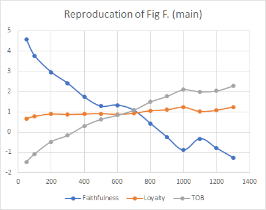
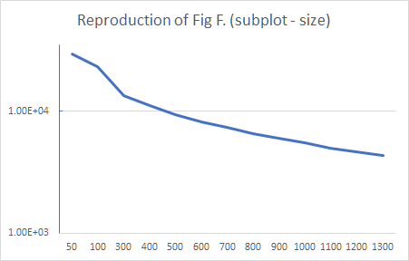

# final project
_code_ &amp; _data_ &amp; _more_ for my MSc final project

## Reproducing [the paper results of Landfried et al.](https://journals.plos.org/plosone/article?id=10.1371/journal.pone.0211014) (successful!:muscle:)

- data: [two tables](https://drive.google.com/drive/folders/13LUQjrzp11D7h1SkU5EX7J2cN78mY6sz?usp=sharing) 
  - respectively selected columns of `play` and `game`; dumped from the original database)
- code: [here](./reproduce.py)
  - current version: please set hyper-parameter `N` (e.g., 100 or 200) which denotes the number of games considered per player
  - the code will return the digest stats of the multivariable linear regression. For example, when `N = 100`, you will get
  
  
  
### Results

#### Detailed stats
| Games played | Faithfulness | Loyalty | TOB     | Size  |
|--------------|:------------:|:-------:|:-------:|:-----:|
| 50           | 4.5811       | 0.6611  | -1.4717 | 29531 |
| 100          | 3.7704       | 0.7675  | -1.0837 | 23365 |
| 200          | 2.9601       | 0.8893  | -0.4751 | 16893 |
| 300          | 2.4072       | 0.8631  | -0.1631 | 13319 |
| 400          | 1.7308       | 0.8849  | 0.3025  | 11021 |
| 500          | 1.2744       | 0.9074  | 0.6281  | 9356  |
| 600          | 1.3268       | 0.8690  | 0.8281  | 8224  |
| 700          | 1.0729       | 0.9221  | 1.0814  | 7324  |
| 800          | 0.4216       | 1.0515  | 1.4900  | 6573  |
| 900          | -0.2542      | 1.0935  | 1.7645  | 5989  |
| 1000         | -0.8966      | 1.2274  | 2.0940  | 5488  |
| 1100         | -0.3258      | 1.0084  | 1.9955  | 4996  |
| 1200         | -0.8014      | 1.0771  | 2.0347  | 4666  |
| 1300         | -1.2704      | 1.2375  | 2.2781  | 4350  |

#### Visualisation

#### Remark
- The overall patterns coincide well
- The reproduction is, however, not __exact__ (due to many possible causes)

  
