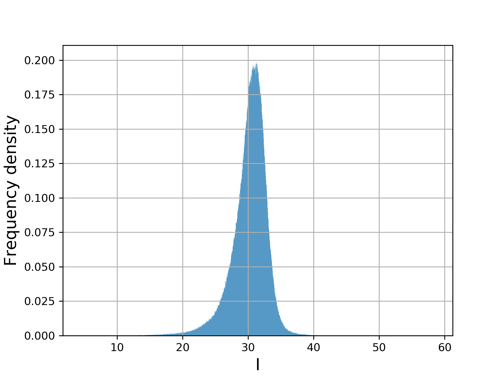
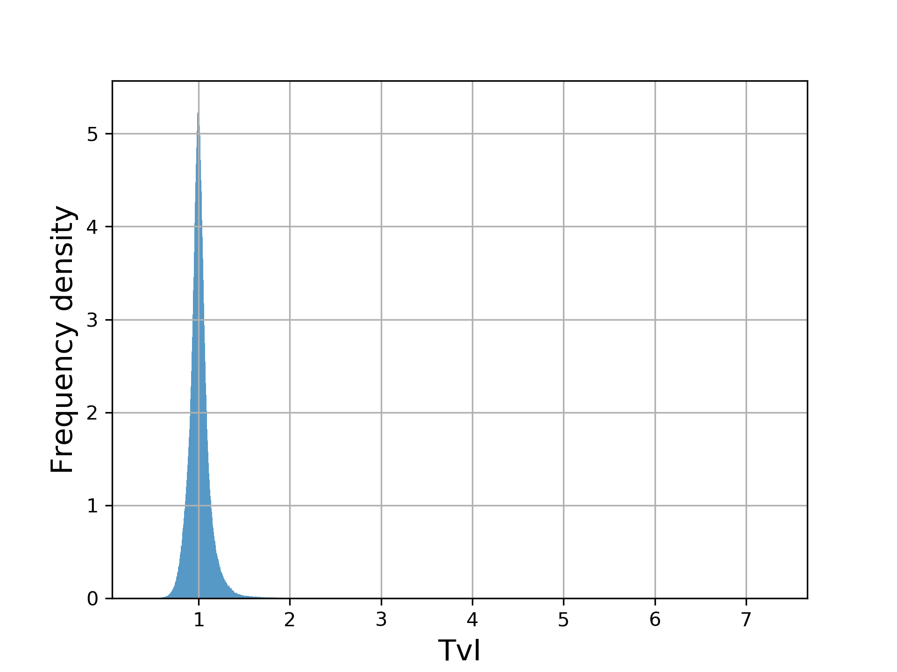
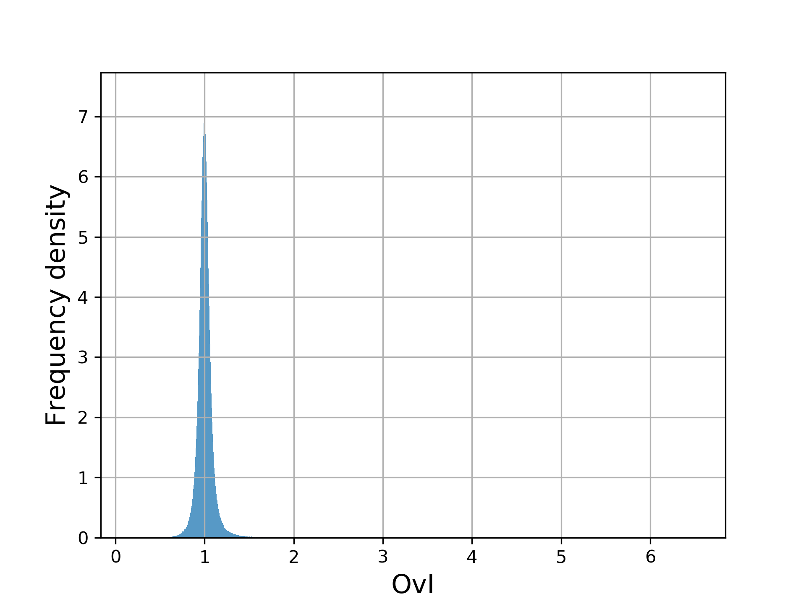
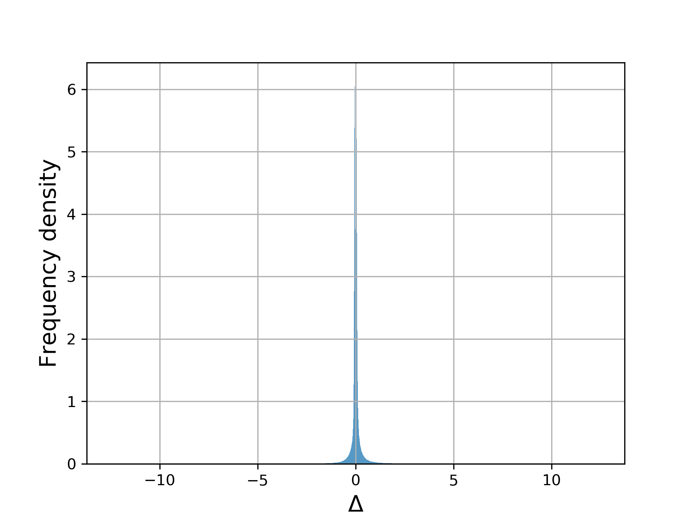
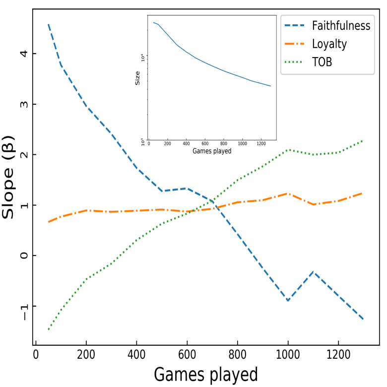
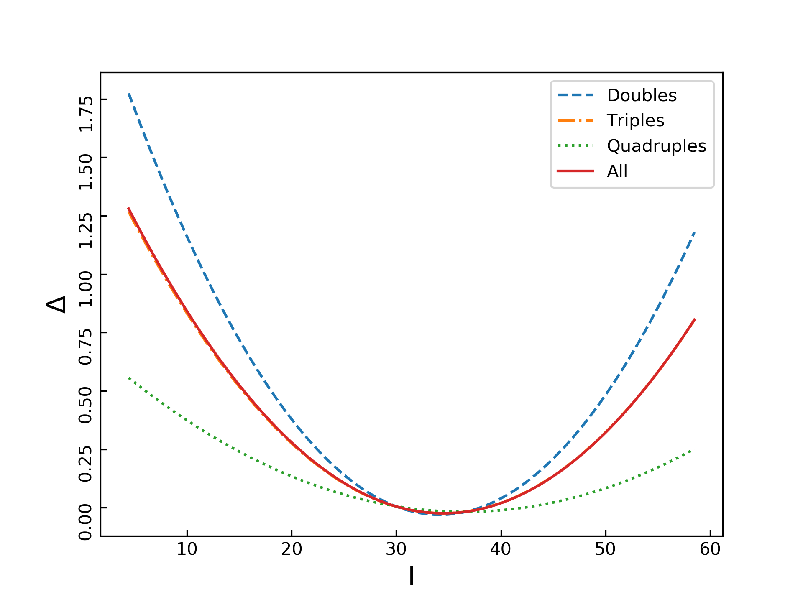
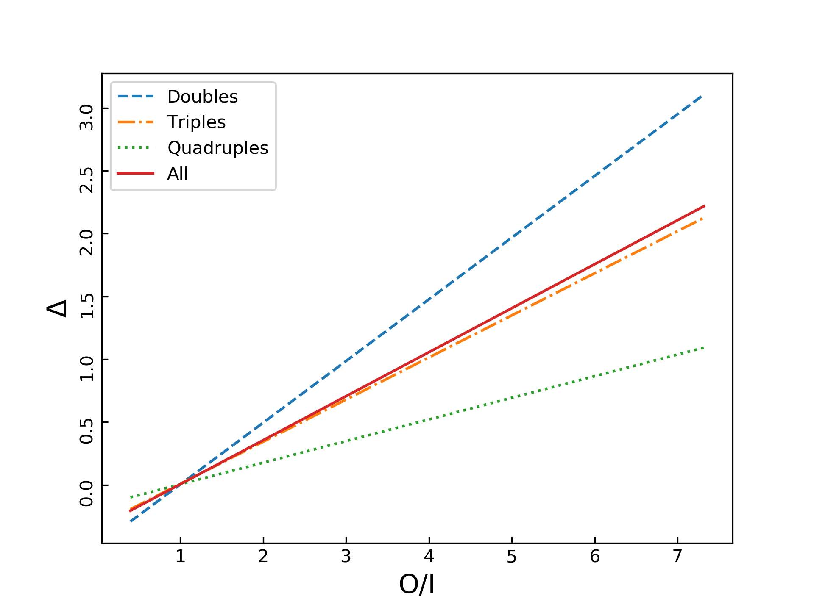
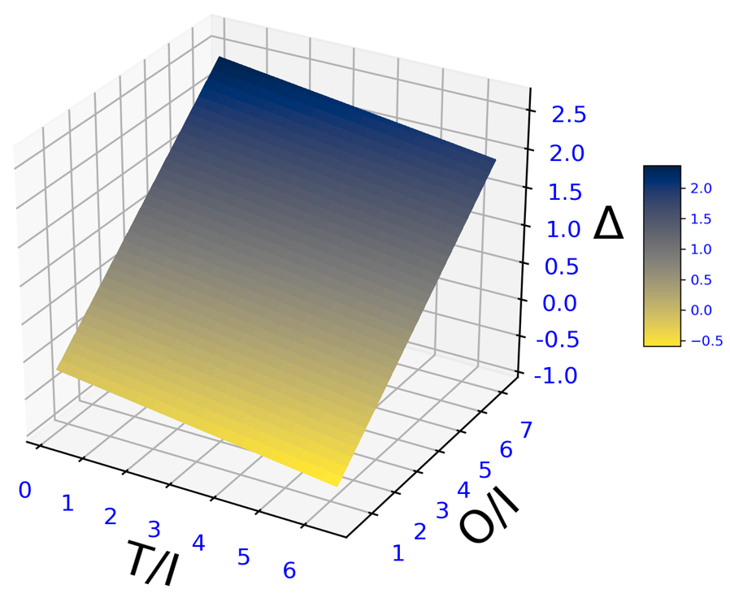

# final project
code and data for my MSc final project. *the report is coming soooooon!*

## TL;DR
 - it's a large-scale analysis on the *Conquer Club* players' skill development
 - the main results of [Landfried et al.](https://journals.plos.org/plosone/article?id=10.1371/journal.pone.0211014) is reproducible
 - the importance of opponents’ skill levels with respect to players’ skill development gets confirmed: competing against higher level opponents is beneficial to skill increments
 - this study fails to conclude if players' changes in skill are influenced by teammates' skill and are moderated jointly by teammates and opponents' skill
 - there exists a nonlinear relationship between skill improvements and pregame skill

## data
### raw sources
my project involves two tables in the orginal database: `play` and `game`. in order to run the uploaded code, you may find it useful to download my retrived tables [here](https://drive.google.com/drive/folders/13LUQjrzp11D7h1SkU5EX7J2cN78mY6sz?usp=sharing) 
### preprocessed data
proprocessing the data is rather computational expensive. therefore, please feel to use my preprocessed data in the `data\` folder. 

## code
 - `reproduce\` code for reproducing the paper of [Landfried et al.](https://journals.plos.org/plosone/article?id=10.1371/journal.pone.0211014)
 - `preprocessing.py` code which outputs three tables in `data\`
 - `regression.py` **robust (with M-estimator) multivariate polyfit**
   - *highlight: the calculation of R^2* 
 - `visualisation\` code which generates the following figures
  
## visualised results
|I | T/I | O/I | Δ |
|---|---|---|---|
|   |   |   |   |
|reproduced faithfulness effect in [Landfried et al.](https://journals.plos.org/plosone/article?id=10.1371/journal.pone.0211014)|effect of players pregame skill on their changes in skill |effect of opponents skill on players changes in skill |interaction of teammates skill and opponents skill on skill increment|
|||||

> if you have any question, just post an issue
  
